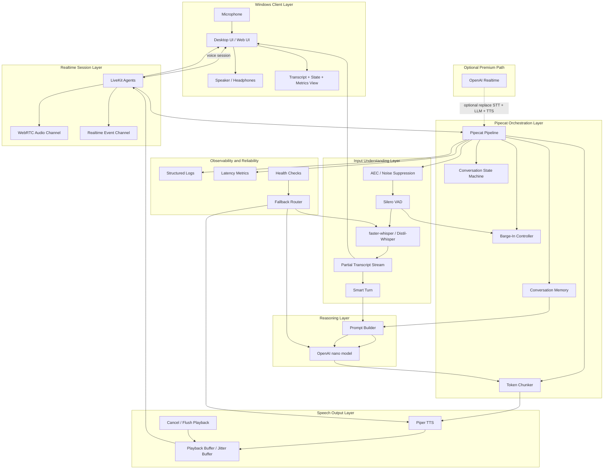
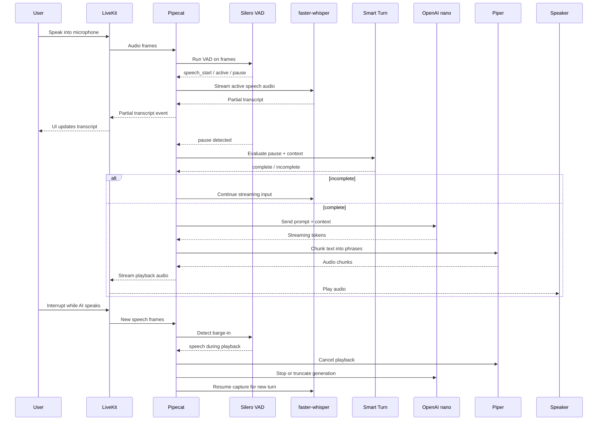
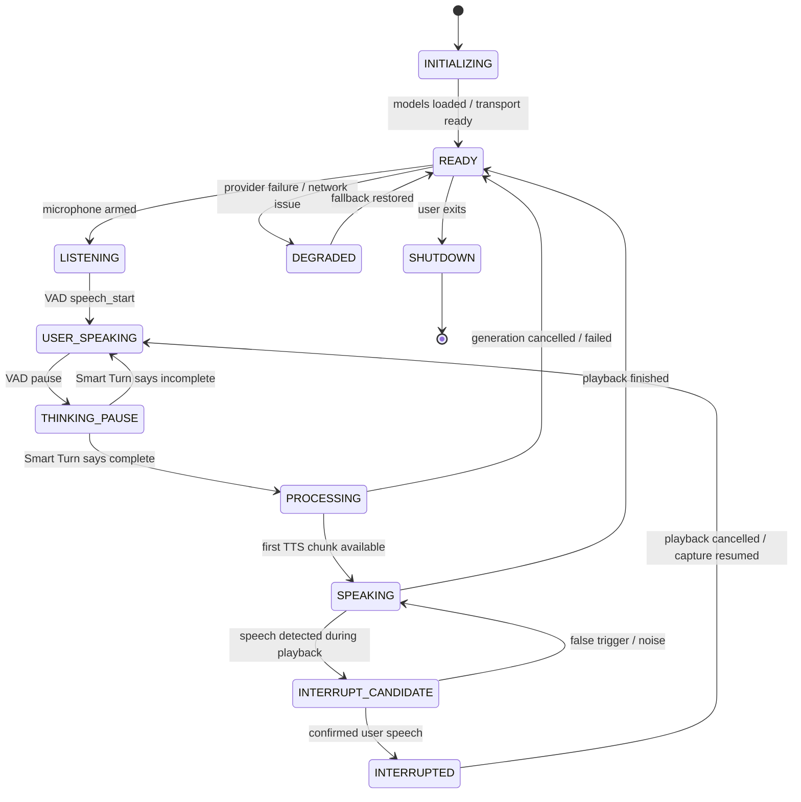
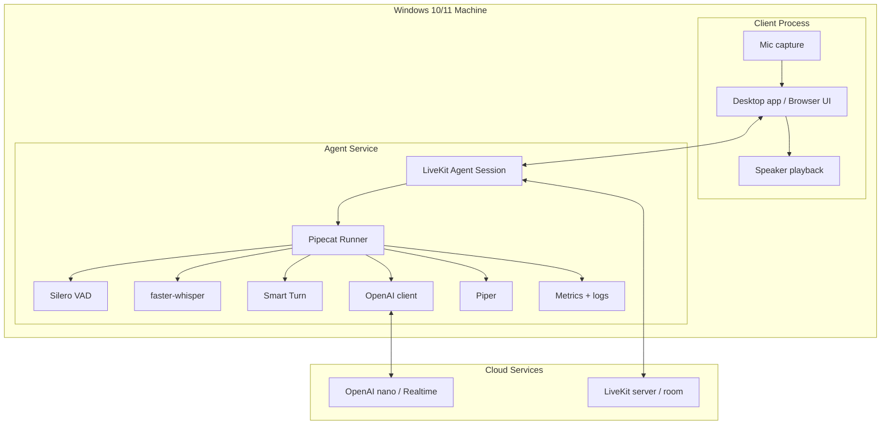

# Complete Windows Voice Conversation Agent Architecture Reference

## 1. Executive Summary

This document consolidates the architecture, design rationale, workflow, diagrams, implementation guidance, latency targets, benchmarking plan, folder structure, pseudocode, risks, and beginner-friendly explanations for a **real-time human-like voice conversation app on Windows 10/11**.[web:23][web:153][web:60] The recommended production baseline is a **streaming cascade architecture** built around **LiveKit Agents**, **Pipecat**, **Silero VAD**, **Pipecat Smart Turn**, **faster-whisper / Distil-Whisper**, an **OpenAI nano text model**, and **Piper**, with **OpenAI Realtime** as an optional premium speech-to-speech or half-cascade mode.[web:153][web:60][web:15]

The key conclusion is that the best practical first release is **not** a simple full-utterance STT → LLM → TTS chain.[web:23] Instead, the system should stream at every stage, keep listening during playback, support interruption, and separate transport from orchestration so components can be replaced later without rewriting the whole application.[web:153][web:60]

## 2. Goals and Constraints

The system is optimized for these goals:[web:23]

- Lowest possible practical first-response latency.
- Lowest possible practical first-audio latency.
- Natural-feeling turn-taking.
- Continuous streaming and partial results.
- User interruption and barge-in support.
- Semantic turn detection, not silence-only turn detection.
- Open-source-first baseline with upgrade path to premium cloud modes.
- Windows 10/11 compatibility.
- Production observability, fallback behavior, and modularity.

The major system constraints are equally important: realtime models can reduce latency but may not provide timely interim transcripts, loaded conversation history can affect audio behavior in some realtime configurations, and pure silence-based turning is too brittle for natural conversation.[web:23][web:153]

## 3. Current Pipeline Review

### Current preferred pipeline

```text
Microphone Audio Input
-> STT using Distilled Whisper / Whisper-compatible model
-> LLM using OpenAI nano model
-> TTS using Piper model
-> Speaker Audio Output
```

### Review of the current idea

This pipeline is a strong **starting point** because it is modular, mostly open-source, and compatible with Windows.[web:15] However, by itself it is incomplete for natural conversation because it does not yet include explicit VAD, semantic turn detection, interruption control, echo management, or streaming chunk policies.[web:15][web:60]

### Keep, replace, or upgrade?

| Component | Verdict | Reason |
|---|---|---|
| Distil-Whisper / faster-whisper | **Keep** | Best practical local open-source streaming STT baseline for this stack.[web:15] |
| OpenAI nano model | **Keep initially** | Strong low-latency cloud reasoning baseline in a modular text pipeline.[web:153] |
| Piper | **Keep initially if open-source-first is mandatory** | Valid local TTS baseline, though not the most human-like option available.[web:15] |
| Silero VAD | **Add** | Required for fast speech start/stop detection and low-latency gating.[web:15] |
| Smart Turn | **Add** | Required to avoid cutting users off during thinking pauses.[web:60] |
| Pipecat | **Add** | Best fit for pipeline orchestration and voice-stage composition.[web:60] |
| LiveKit Agents | **Add** | Best fit for realtime media/session transport and client connectivity.[web:153] |
| OpenAI Realtime | **Optional mode** | Valuable as premium mode, but not ideal as the only baseline due to transcript/control trade-offs.[web:23][web:153] |

## 4. Better Architecture Options

### Option 1: Classic sequential pipeline

```text
STT -> LLM -> TTS
```

This is the easiest architecture to build, but it is too slow for a natural conversation agent because each stage waits for the previous stage to finish.[web:23]

### Option 2: Streaming cascade pipeline

```text
Streaming STT partials -> streaming LLM tokens -> streaming TTS chunks
```

This is the recommended production baseline because it preserves visibility into text, allows partial transcript UI, supports chunked TTS, and makes interruption easier to control than a monolithic speech-to-speech pipeline.[web:23][web:153]

### Option 3: Realtime speech-to-speech model

```text
Audio input -> realtime multimodal model -> audio output
```

LiveKit documents realtime models as capable of directly consuming and producing speech, bypassing STT and TTS, which can improve emotional speech understanding and output naturalness.[web:23] However, realtime models generally do not provide interim transcripts and may delay transcriptions relative to the response, which is a major drawback if transcript visibility matters.[web:23]

### Option 4: Half-cascade / text-only realtime understanding + custom TTS

```text
Audio input -> OpenAI Realtime (text-only modality) -> custom TTS
```

LiveKit explicitly supports this configuration by running the realtime model with `modalities=["text"]` and attaching a separate TTS instance, which preserves control over output speech while still leveraging realtime audio understanding.[web:23][web:153]

### Option 5: Hybrid local/cloud cascade

```text
Local VAD + local STT + local TTS + cloud LLM
```

This is often the most practical deployment shape because it keeps the latency-sensitive input/output edges local while using the cloud only for reasoning.[web:153]

### Option 6: Fully local pipeline

```text
Local VAD + local STT + local LLM + local TTS
```

This gives maximum privacy and minimal cloud dependency, but hardware becomes the limiting factor, especially for sustained low-latency turn-taking on Windows laptops without strong GPUs.[web:15]

## 5. Recommended Final Architecture

The best production-ready architecture for the requested stack is a **modular hybrid realtime cascade**:[web:153][web:60][web:15]

- **Client/UI**: Windows desktop or web UI.
- **Realtime transport**: LiveKit Agents.
- **Pipeline orchestration**: Pipecat.
- **Speech detection**: Silero VAD.
- **Semantic turn detection**: Pipecat Smart Turn.
- **Streaming STT**: faster-whisper with Distil-Whisper.
- **Reasoning**: OpenAI nano model in streaming text mode.
- **Streaming TTS**: Piper.
- **Optional premium mode**: OpenAI Realtime, either full speech-to-speech or text-only half-cascade mode with separate TTS.[web:23][web:153]

## 6. Full Architecture Diagrams

### 6.1 High-level system architecture



### 6.2 Real-time streaming sequence diagram



### 6.3 Barge-in state machine



### 6.4 Audio processing pipeline


### 6.5 Windows deployment architecture



### 6.6 Latency measurement flow


## 7. Component Responsibilities and Necessity

### 7.1 LiveKit Agents

**Definition:** LiveKit Agents is the realtime communication/session layer that manages media transport, room/session lifecycle, and client connectivity.[web:153]

**Why necessary:** Without it, the system must implement low-level signaling, voice session control, realtime audio routing, and client/session coordination from scratch.[web:153] LiveKit solves the session transport problem so the system can focus on intelligence and latency behavior.[web:23]

### 7.2 Pipecat

**Definition:** Pipecat is the orchestration framework that routes frames and events between transport, VAD, turn logic, STT, LLM, and TTS.[web:60]

**Why necessary:** A production voice system needs more than sequential function calls; it needs explicit pipeline coordination, interruption paths, and transport-aware stage control.[web:60]

### 7.3 Silero VAD

**Definition:** Silero VAD is a lightweight voice activity detector that identifies whether speech is present in audio.[web:15]

**Why necessary:** The app needs fast speech start detection, fast pause detection, input gating, and playback-time interruption sensing.[web:15]

### 7.4 Smart Turn

**Definition:** Smart Turn is a semantic end-of-turn decision layer that classifies whether a detected pause means the user is actually done speaking.[web:60]

**Why necessary:** Silence does not always mean completion; users pause mid-thought.[web:60] Smart Turn prevents premature AI responses and supports more human-like pacing.[web:60]

### 7.5 faster-whisper / Distil-Whisper

**Definition:** faster-whisper is a high-performance Whisper inference path and Distil-Whisper is a distilled Whisper-family model optimized for speed and efficiency.[web:15]

**Why necessary:** The architecture needs local streaming STT with partial transcript support, good enough accuracy, and reasonable Windows feasibility.[web:15]

### 7.6 OpenAI nano model

**Definition:** A low-latency OpenAI text model used as the main reasoning engine in the cascade path.[web:153]

**Why necessary:** Once the user turn is ready, the system needs a streaming text response engine that can emit speech-friendly tokens fast enough to start TTS early.[web:153]

### 7.7 Piper

**Definition:** Piper is an open-source offline text-to-speech engine.[web:15]

**Why necessary:** It keeps the baseline stack open-source-first and allows speech output without depending on a premium cloud TTS provider.[web:15]

### 7.8 OpenAI Realtime

**Definition:** OpenAI Realtime is a low-latency multimodal realtime model/API path that can operate directly over speech/audio and optionally text.[web:23][web:153]

**Why necessary:** It is useful as an optional premium mode when the application wants direct speech-to-speech behavior or a half-cascade text-only realtime understanding mode with separate TTS.[web:23][web:153]

## 8. Detailed End-to-End Workflow

### 8.1 Startup workflow

1. Load configuration, secrets, model paths, and runtime thresholds.
2. Start LiveKit connectivity and room/session setup.[web:153]
3. Start the Pipecat runner and initialize the conversation state machine.[web:60]
4. Initialize audio capture, playback, loopback, and preprocessing chains.
5. Load Silero VAD.[web:15]
6. Load Smart Turn.[web:60]
7. Load faster-whisper / Distil-Whisper.[web:15]
8. Initialize OpenAI nano client.[web:153]
9. Load Piper voice model.[web:15]
10. Warm up STT with a small sample.
11. Warm up LLM with a short token request.
12. Warm up TTS with a short phrase.
13. Initialize metrics/logging and health endpoints.
14. Enter READY state.

### 8.2 Conversation workflow

1. User speech enters through the microphone and is carried by the session layer.[web:153]
2. Pipecat receives audio frames.[web:60]
3. Audio passes through echo cancellation and noise suppression before downstream analysis.
4. Silero VAD emits speech_start, speech_active, or pause signals.[web:15]
5. While speech is active, faster-whisper ingests buffered speech audio and returns partial transcripts.[web:15]
6. Partial transcripts are sent to the UI in realtime.[web:153]
7. When a pause is detected, Smart Turn decides whether the turn is complete or incomplete.[web:60]
8. If incomplete, capture continues with no response.
9. If complete, Pipecat builds the prompt from the current transcript plus short-term memory.[web:60]
10. OpenAI nano begins streaming tokens.[web:153]
11. Tokens are chunked into speech-safe phrases or sentence fragments.
12. Piper begins synthesis on the earliest stable chunk.[web:15]
13. First audio is played before the full answer is complete.
14. The microphone remains active during AI playback for barge-in detection.[web:23][web:153]
15. If interruption occurs, playback is stopped immediately and generation is cancelled or truncated as needed.[web:153]
16. The system resumes capture and continues the conversation naturally.

## 9. Voice Activity Detection and Turn Detection Design

### VAD versus semantic turn detection

VAD answers, “Is there speech audio right now?” while semantic turn detection answers, “Has the user finished the thought?”.[web:15][web:60] Both are necessary because VAD alone cannot distinguish a thinking pause from a finished sentence.[web:60]

### Recommended VAD strategy

- Run VAD continuously on small audio frames.[web:15]
- Use VAD speech_start to reduce first-turn latency.
- Use VAD pause events to trigger Smart Turn.
- Use a short pre-speech buffer so the first word is not clipped.

### Recommended turn detection strategy

- Use VAD for speech/pause boundaries.[web:15]
- Use Smart Turn for semantic completion.[web:60]
- Use transcript punctuation and trailing words as a secondary heuristic.
- Use adaptive timeout when the utterance looks incomplete.
- Keep a hard maximum silence fallback so the system never waits forever.

### Example policy pseudocode

```python
if vad_event == "speech_start":
    state = USER_SPEAKING
    start_stt_stream()

if vad_event == "pause":
    decision = smart_turn.evaluate(last_audio, partial_transcript)
    if decision == "incomplete":
        keep_listening(timeout="adaptive")
    else:
        finalize_turn()
        dispatch_llm()
```

## 10. Barge-in Design

### Full barge-in mechanism

The app must keep listening while the AI speaks, because interruption is one of the strongest signals of natural conversational quality.[web:23][web:153] The same principle applies in the cascade path with Pipecat controlling local state.[web:60]

### Barge-in pseudocode

```python
if state == SPEAKING and vad.detect(clean_mic_frame):
    if confirm_user_speech(frame_window):
        playback.stop_now()
        tts_queue.clear()
        llm.cancel_if_needed()
        state = INTERRUPTED
        stt.resume_from_interruption()
```

### False barge-in prevention

- Require multiple consecutive speech-positive frames.
- Run AEC before VAD when using speakers.
- Use noise suppression to reduce transient environmental triggers.
- Ignore extremely short noise bursts.
- Prefer headphones when testing the first version.

## 11. Echo Cancellation Design

Echo cancellation is mandatory for speaker + microphone use because the AI's own output can be re-captured and treated as user speech.[web:23] The correct placement is **before** VAD and STT in the input chain so the AI does not hear itself.[web:15]

### Recommended preprocessing order

```text
Mic -> AEC -> Noise Suppression -> Optional Careful AGC -> Silero VAD -> STT
```

### Why careful AGC?

Automatic gain control can help in weak-microphone conditions, but over-aggressive gain changes may distort speech cues that matter for STT and VAD, so it should be conservative or optional in the first production build.

## 12. Streaming TTS Design

### Why streaming TTS matters

If the system waits for the full LLM answer before calling TTS, the conversation will feel sluggish even if the total answer quality is good.[web:23] The correct behavior is to begin synthesis when a stable phrase is available.[web:153]

### Chunking strategy

- Prefer punctuation boundaries.
- Use a minimum chunk size to avoid robotic micro-fragments.
- Use a maximum buffer size to avoid waiting too long for a perfect sentence.
- Keep chunks interruptible.

### Example chunking pseudocode

```python
buffer = ""
for token in llm_stream:
    buffer += token
    if sentence_boundary(buffer) and len(buffer) >= min_chars:
        send_to_tts(buffer)
        buffer = ""
    elif len(buffer) >= max_chars:
        part, buffer = split_at_last_space(buffer)
        send_to_tts(part)
```

## 13. Windows App Architecture Recommendations

### Fastest prototype

- Python backend.
- Simple desktop or local web UI.
- LiveKit for session transport.[web:153]
- Pipecat for orchestration.[web:60]
- faster-whisper + Silero + Piper local stack.[web:15]

### Best production architecture

- Windows desktop client or browser client.
- LiveKit Agents as transport/session layer.[web:153]
- Pipecat service process as orchestration layer.[web:60]
- Cloud OpenAI nano reasoning by default.[web:153]
- Local STT/TTS for open-source-first baseline.
- Optional OpenAI Realtime premium adapter path.[web:23][web:153]

### Best low-latency local Windows architecture

- Local audio preprocessing.
- Silero VAD and Smart Turn local.[web:15][web:60]
- Local faster-whisper STT.[web:15]
- Small local or cloud LLM depending hardware budget.
- Local Piper TTS.[web:15]
- LiveKit still retained for transport/session consistency in multi-client or browser-connected deployments.[web:153]

## 14. Latency Budget

| Stage | Excellent | Acceptable | Poor |
|---|---:|---:|---:|
| Mic frame capture | 10–20 ms | 20–40 ms | > 60 ms |
| VAD detection | < 10 ms | < 20 ms | > 40 ms |
| AEC / preprocessing | 10–30 ms | 30–60 ms | > 100 ms |
| First partial transcript | 150–300 ms | 300–600 ms | > 800 ms |
| Turn completion delay | 0–150 ms | 150–350 ms | > 600 ms |
| LLM first token | 80–250 ms | 250–500 ms | > 800 ms |
| TTS first audio | 80–200 ms | 200–400 ms | > 700 ms |
| Playback buffer | 20–50 ms | 50–100 ms | > 150 ms |
| Total first audio | 400–800 ms | 800–1300 ms | > 1800 ms |

These values are operational targets for a human-like experience rather than strict guarantees.[web:23]

## 15. Benchmarking Plan

### Test environments

- Quiet room, internal laptop mic.
- Quiet room, external USB mic.
- Noisy room.
- Speakers active without headphones.
- Headphones active.
- Strong GPU machine.
- Low-end CPU-only machine.

### Test cases

- One-word utterances.
- Mid-sentence pause.
- Long sentence.
- User interruption during AI speech.
- Fast back-and-forth conversation.
- Indian accent English.
- Mixed Hindi-English if relevant.
- Slow internet for cloud LLM/realtime mode.

### Metrics

- Time to VAD speech_start.
- Time to first partial transcript.
- Time to final transcript.
- Turn-completion accuracy.
- False interruption rate.
- Missed interruption rate.
- LLM first-token latency.
- TTS first-audio latency.
- End-to-end first-audio latency.
- CPU, GPU, and RAM usage.

## 16. Folder Structure

```text
voice-agent/
├── apps/
│   ├── desktop-client/
│   └── web-client/
├── services/
│   ├── orchestrator/
│   │   ├── pipeline/
│   │   ├── turn_detection/
│   │   ├── stt/
│   │   ├── llm/
│   │   ├── tts/
│   │   ├── audio/
│   │   ├── transport/
│   │   ├── bargein/
│   │   └── api/
│   └── optional-realtime/
├── config/
│   ├── prompts/
│   ├── dev.yaml
│   └── prod.yaml
├── tests/
│   ├── unit/
│   ├── integration/
│   └── latency/
├── scripts/
├── observability/
├── docs/
├── pyproject.toml
└── README.md
```

## 17. Core Pseudocode

### 17.1 Audio capture loop

```python
while app_running:
    frame = microphone.read()
    clean = preprocess(frame)
    pipeline.push_audio(clean)
```

### 17.2 VAD + STT loop

```python
for frame in audio_stream:
    vad_event = silero.process(frame)
    if vad_event in ("speech_start", "speech_active"):
        transcript = stt.stream(frame)
        emit_partial(transcript)
    elif vad_event == "pause":
        evaluate_turn()
```

### 17.3 Turn detection

```python
def evaluate_turn():
    decision = smart_turn.evaluate(last_audio_window, partial_transcript)
    if decision == "complete":
        dispatch_llm()
    else:
        continue_listening()
```

### 17.4 LLM streaming + TTS chunking

```python
for token in llm.stream(prompt):
    token_buffer += token
    if should_flush_to_tts(token_buffer):
        tts.enqueue(token_buffer)
        token_buffer = ""
```

### 17.5 Playback + barge-in

```python
while playback.active:
    if vad.detect(mic_frame):
        if confirm_bargein():
            playback.stop_now()
            llm.cancel_if_needed()
            break
```

## 18. Risks and Mitigations

| Risk | Impact | Mitigation |
|---|---|---|
| Speaker echo triggers self-transcription | High | Put AEC before VAD/STT, prefer headphones in early testing |
| Silence-only turning cuts users off | High | Use Smart Turn, not VAD alone.[web:60] |
| Realtime path lacks interim transcript visibility | Medium | Keep cascade path as primary baseline.[web:23] |
| Conversation history causes text-only response in some realtime modes | Medium | Use text-only modality + separate TTS when loading history.[web:23][web:153] |
| CPU-only local inference is too slow | High | Use cloud LLM initially or reduce local model size |
| False barge-ins from noise | Medium | Require multi-frame confirmation and preprocessing |
| TTS waits too long | Medium | Use chunked streaming TTS strategy |

## 19. Detailed GitHub Copilot Master Prompt

```text
You are a senior realtime Voice AI engineer, Windows audio engineer, Python systems architect, and production backend developer.

Build a production-ready realtime Windows 10/11 voice conversation agent using the following stack:
- LiveKit Agents for realtime transport/session handling.
- Pipecat for internal pipeline orchestration.
- Silero VAD for speech activity detection.
- Pipecat Smart Turn for semantic end-of-turn detection.
- faster-whisper with Distil-Whisper for local streaming STT.
- OpenAI nano model for low-latency streaming LLM responses.
- Piper for local TTS.
- Optional OpenAI Realtime adapter as a premium alternative mode.

Primary goal:
Create the lowest-latency possible human-like voice conversation app with support for streaming, partial transcripts, interruption, barge-in, semantic turn detection, cancellation, logging, health checks, and clear module boundaries.

Technical requirements:
1. Python backend as the primary implementation language.
2. Clean modular architecture with folders for audio, transport, pipeline, turn detection, STT, LLM, TTS, barge-in, API, config, tests, and docs.
3. Build an explicit conversation state machine with states:
   INITIALIZING, READY, LISTENING, USER_SPEAKING, THINKING_PAUSE, PROCESSING, SPEAKING, INTERRUPTED, DEGRADED, SHUTDOWN.
4. Support streaming at every stage:
   microphone frames -> VAD -> STT partials -> Smart Turn -> LLM tokens -> TTS chunks -> playback.
5. Keep microphone listening active during playback to support barge-in.
6. On barge-in:
   - stop TTS immediately,
   - cancel any in-flight remaining LLM generation if needed,
   - preserve completed context safely,
   - resume capture for the new user utterance.
7. Expose transcript, state, and latency metrics to the UI.
8. Add structured logging and metrics for:
   - first speech detection latency,
   - time to partial transcript,
   - turn completion delay,
   - LLM first-token latency,
   - TTS first-audio latency,
   - interruption detection latency,
   - end-to-end first audio latency.
9. Add a fallback-ready abstraction so STT, LLM, and TTS providers can be swapped later.
10. Make the code production-grade, typed, testable, and split into small modules.

Implementation details:
- Use asyncio where appropriate.
- Use interface/adapter patterns for STT, LLM, TTS, and transport.
- Create a ring buffer for mic frames.
- Create transcript buffers and chunking logic for TTS-friendly sentence groups.
- Implement Smart Turn invocation only after VAD pause events.
- Use short speech-oriented prompts for the OpenAI model.
- Make Piper playback chunk-interruptible.
- Add configuration files for development and production.
- Add unit tests and integration tests for state transitions and interruption handling.

Deliverables to implement:
1. Full folder structure.
2. Core classes and interfaces.
3. State machine implementation.
4. Pipecat pipeline wiring.
5. LiveKit transport adapter.
6. Silero VAD adapter.
7. Smart Turn adapter.
8. faster-whisper streaming adapter.
9. OpenAI nano streaming adapter.
10. Piper TTS adapter.
11. Barge-in controller.
12. WebSocket or LiveKit event schema for UI updates.
13. Health check and metrics endpoints.
14. Example configuration files.
15. README with setup and run instructions.

Code quality expectations:
- Strong typing.
- Docstrings on public classes.
- Clear separation of concerns.
- No monolithic files.
- Graceful error handling and retries.
- No placeholder pseudocode in final modules.
- Provide real runnable scaffolding.

Start by generating:
1. the folder structure,
2. the shared interfaces,
3. the state machine,
4. the pipeline wiring,
5. then the concrete adapters one by one.

After each major module, explain how it connects to the rest of the system.
```

## 20. End-to-End Explanation for a 10-Year-Old

Think of the whole app like a team of tiny helpers inside a robot friend.[web:15][web:60]

- **LiveKit** is the telephone wire that carries your voice to the robot and brings the robot's voice back.[web:153]
- **Pipecat** is the team captain that tells everyone when to start and stop.[web:60]
- **Silero VAD** is the ear helper that notices when you start talking.[web:15]
- **Smart Turn** is the polite helper that checks if you are really done or just thinking.[web:60]
- **faster-whisper / Distil-Whisper** is the writer helper that writes your words down.[web:15]
- **OpenAI nano** is the brain helper that thinks of the reply.[web:153]
- **Piper** is the mouth helper that says the answer aloud.[web:15]
- **OpenAI Realtime** is like a super-fast all-in-one talking brain that can sometimes do more by itself.[web:23][web:153]

### Realtime example for a 10-year-old

You say, “What is the biggest planet?” The ear helper notices you started. The writer helper starts writing your words. The polite helper waits to see if you are done. The brain helper thinks of the answer. The mouth helper starts saying, “The biggest planet is Jupiter,” even before the whole long answer is ready.[web:15][web:60][web:153]

Another example: the robot starts talking, and you quickly say, “Wait, I mean in our solar system.” The ear helper hears you, the captain stops the robot's mouth, and the robot listens to your new words right away.[web:23][web:153]

## 21. End-to-End Explanation for a Novice User

A novice-friendly way to understand this system is to treat it as a **realtime assembly line for conversation**.[web:23] Each part does one job, and the app only feels human when those jobs overlap instead of waiting for each other one by one.[web:23][web:153]

### Step 1: Transport

The voice has to move between the user and the backend in realtime. That is what **LiveKit Agents** does.[web:153] It is the session and transport backbone of the app.

**Example:** When the user opens the app in a browser or desktop client and speaks, LiveKit carries the live audio stream into the agent session.[web:153]

### Step 2: Orchestration

Once audio arrives, the app needs an internal coordinator. That is **Pipecat**.[web:60] It decides what gets routed to VAD, STT, LLM, TTS, and what should happen if the user interrupts.

**Example:** If the user interrupts while the AI is speaking, Pipecat coordinates “stop playback, stop remaining speech chunks, listen again.”[web:60]

### Step 3: VAD

The app should not process every sound equally. **Silero VAD** decides whether the input contains speech.[web:15]

**Example:** If the room is quiet and the user suddenly says “hello,” VAD quickly marks that as speech start so the rest of the pipeline wakes up immediately.[web:15]

### Step 4: Semantic turn detection

Speech often contains short pauses. **Smart Turn** helps the system avoid responding too early.[web:60]

**Example:** The user says, “I need help with... my Python environment,” with a short pause. VAD sees silence, but Smart Turn says the thought is incomplete, so the AI keeps waiting.[web:60]

### Step 5: STT

When speech is active, **faster-whisper / Distil-Whisper** converts it into text incrementally.[web:15]

**Example:** While the user is still talking, the UI can already show partial text like “can you help me install...” before the sentence is complete.[web:15]

### Step 6: LLM reasoning

Once the user is done, the transcript is sent to the **OpenAI nano model**.[web:153] It generates text tokens in a stream so the system does not have to wait for a full paragraph.

**Example:** For “Explain virtual environments in Python,” the model may begin with “A virtual environment is...” immediately, which is enough to start TTS.[web:153]

### Step 7: TTS

The generated text has to be spoken back. **Piper** converts the text chunks into audio.[web:15]

**Example:** The moment the phrase “A virtual environment is...” is available, Piper can begin speaking instead of waiting for the whole answer.[web:15]

### Step 8: Interruption

A natural conversation means the AI should stop if the user starts talking again.[web:23][web:153]

**Example:** The AI says, “A virtual environment is an isolated...” and the user interrupts with “Actually I use Conda.” The system should stop playback immediately and switch back to listening/transcribing mode.[web:23][web:153]

### Step 9: Optional realtime mode

Instead of separate STT, LLM, and TTS, the system can optionally use **OpenAI Realtime**.[web:23][web:153] This can be faster and more expressive, but it reduces transcript visibility and modular control unless used in text-only half-cascade mode.[web:23][web:153]

**Example:** A premium customer support deployment might use OpenAI Realtime for the smoothest voice feel, while an enterprise internal deployment might keep the streaming cascade for transcripts, debugging, and policy control.[web:23][web:153]

## 22. Final Recommendation

The corrected final recommendation is to ship the first serious version as a **streaming modular cascade** with **LiveKit Agents + Pipecat + Silero VAD + Smart Turn + faster-whisper / Distil-Whisper + OpenAI nano + Piper**, while keeping **OpenAI Realtime** as a configurable premium path or half-cascade experimental mode.[web:153][web:60][web:15][web:23] This preserves the best balance of low latency, interruptibility, transcript visibility, modularity, and future flexibility on Windows.[web:23][web:153]
